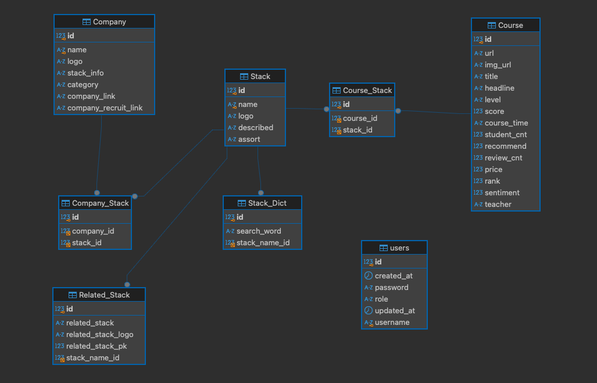

# 장고를 스프링부트로 변환 프로젝트
- 장고 프로젝트 링크: [GitHub Repository](https://github.com/dpcks/kokonenne)
- [Ofcourse 홈페이지 링크](http://43.201.25.239:8080/)

### Django와 Spring Boot의 주요 구성요소 비교

| Django 구성요소       | Spring Boot 구성요소         | 설명                                           |
|-----------------------|-----------------------------|----------------------------------------------|
| **프로젝트(project)** | **프로젝트(Maven/Gradle)**  | Django의 프로젝트와 유사한 역할 수행          |
| **앱(app)**           | **패키지(package)**         | Django 앱은 Spring에서의 패키지와 유사        |
| **views.py**          | **Controller**             | URL 요청을 처리하는 부분 매핑                 |
| **models.py**         | **Entity + Repository**    | 데이터베이스와의 인터페이스 제공              |
| **urls.py**           | **@RequestMapping**        | URL과 컨트롤러 메서드 연결                    |
| **settings.py**       | **application.yml/properties** | 환경 설정 파일                              |
| **템플릿(template)**  | **Thymeleaf/Freemarker**   | HTML 렌더링을 위한 템플릿 엔진               |

## 목차

0. [**홈페이지 링크**](#0)
1. [**프로젝트 소개**](#1)
1. [**기술 스택**](#2)
1. [**주요 기능**](#3)
1. [**트러블 슈팅**](#4)
2. [**ERD**](#5)
5. [**개발 기간 및 일정**](#6)
6. [**본인 BE 기여도**](#7)

---

## 🔗 홈페이지 링크

### [Ofcourse 홈페이지 링크](http://43.201.25.239:8080/)

---

## 💻 프로젝트 소개

### 주제
- 기업들의 사용 기술 스택 정보 제공 및 맞춤 인터넷 강의 추천 프로젝트

### 프로젝트 개요/동기
- 서비스 대상 : 개발 입문자, IT기업 취준생
- 기획 의도 및 목표 :
    - IT기업에 취업하고자 하는 비전공자의 수가 꾸준히 증가하고 있는 현실을 반영하여, IT기업이 사용하고 있는 기술 스택들에 대한 정보를 이용자에 제공
        -  구인 기업들의 IT기술 스택별로 학습할 수 있는 정보 제공
    - **Spring Boot의 구조 및 MVC 패턴에 대한 이해**
    - **MyBatis, JPA** 등 데이터 접근 기술을 활용하여 데이터 계층 설계를 학습
    - **RESTful API 설계 및 보안(Spring Security)** 구현을 통해 백엔드 애플리케이션의 보안성을 높이는 방법 학습
    - Django에서 Java(Spring Boot)로 전환함으로써 **타 언어 기반의 백엔드 프레임워크와 비교** 및 차이점을 경험

### 기대효과
- Django에서 Spring Boot로 전환하는 과정을 통해 **Java 기반의 백엔드 개발 역량**을 강화
- **객체지향 설계 원칙**(SOLID 등)을 실제 애플리케이션에 적용해 구조화된 시스템 개발 능력 향상
- 대규모 애플리케이션 개발에 적합한 **Spring Boot의 유연성 및 확장성**을 체감하고, 추후 프로젝트에 응용할 수 있는 역량 확보

---

## ⚒️ 기술 스택
### Frontend

| HTML | CSS |  Java Script | Bootstrap |
|------|-----|------------|-----------|
|  |  |  |  |

### Backend

| Java                                                                                | Spring Boot                                                                       | MySQL |
|-------------------------------------------------------------------------------------|---------------------------------------------------------------------------------------|-------|
|  |  |  |

### Infra

| AWS EC2 |
|---------|
|  |

### Tools

| GitHub | intelij                                                                                           | Notion |
|--------|---------------------------------------------------------------------------------------------------|-------|
|  |  |  |

---

## ⭐️ 주요기능

|    기능     | 내용                                                                                  |
| :---------------:|:------------------------------------------------------------------------------------|
|  기술 스택 | 현업에서 쓰이는 기술스택과 연관 기술스택을 포지션별로 볼 수 있습니다.                                             |
|  검색 기능 향상| 자동검색어(autocomplete) 기능과 기술 스택 사전을 구축함으로 강의 검색 기능 향상                                 |
|  IT 회사 | 회사들이 사용하는 기술스택을 보여주며, 어떤 회사들이 있는지 볼 수 있습니다.                                         
|  강의    | 기술 스택과 과련된 강의를 볼 수 있습니다.                                                            |
|    추천 알고리즘 | 여러인강사이트에서 수집한 강의들에 리뷰나 추천 수 ,별점에 대해 감정분석을 진행해 점수를 부여해 랭킹을 매겨 스택에 대한 순위별로 강의를 보여줍니다. |

---

## 💥 트러블슈팅 (troubleshooting)

Django에서는 기업 데이터 조회 시, 각 기업에 연관된 스택 데이터를 개별적으로 조회하여 N+1 문제가 발생 
SpringBoot에서는 아래와 같이 두번의 쿼리로 모든 데이터를 가져와서 이문제를 해결 
1. 첫번째 쿼리로 페이지네이션을 적용해 기업 데이터를 한번에 조회
2. 두 번째 쿼리에서 해당 기업들의 ID 목록을 기반으로 모든 스택 데이터를 한 번에 조회
3. 조회된 스택 데이터를 기업 ID별로 그룹화(Map)하고, 이를 기업 리스트에 매핑하여 스택 정보를 설정
이 방식으로 불 필요한 반복 쿼리를 방지하고 성능을 최적화했습니다.

---

## 📂 ERD

---

## 🗓️ 개발 기간 및 일정

2024.12.04 - 2024.12.20

---

## 👨‍💻 본인 BE 기여도

### 1. 프로젝트 아키텍처 설계
- 기존 **Django 기반**을 **Spring Boot MVC 패턴**으로 재구현하고, **RESTful API** 설계 및 컨트롤러를 개발했습니다.
- **MyBatis**를 사용해 주요 비즈니스 로직을 처리하는 **Mapper 및 Service 레이어**를 구축했습니다.

### 2. DB 마이그레이션
- **Django ORM**을 Spring Boot로 전환하는 과정에서 **MyBatis**를 주로 사용해 데이터 엑세스 계층을 개발했습니다.
- **Spring Security**에서 사용자 인증 및 권한 관리는 **JPA**를 활용해 구현했습니다.
- **MySQL 스키마** 설계를 수정 및 최적화해 **성능을 향상**시켰습니다.

### 3. 기능 구현
- **MyBatis**를 사용해 **복잡한 쿼리**를 최적화하고, **페이징 및 검색 기능**을 추가했습니다.
- **AJAX**를 통해 비동기 요청을 보내고, 서버에서 검색 결과를 반환해 **검색어 자동완성**을 구현했습니다.

### 4. 배포 및 유지보수
- **AWS EC2** 인스턴스에 **Spring Boot 애플리케이션 서버**와 **MySQL 데이터베이스**를 함께 배포했습니다.
- **Thymeleaf**를 사용해 **서버 사이드 렌더링**으로 배포 및 유지보수가 용이하며,  
  **Fragment 레이아웃**을 재사용해 **HTML 중복을 최소화**하고 유지보수를 효율적으로 진행했습니다.
